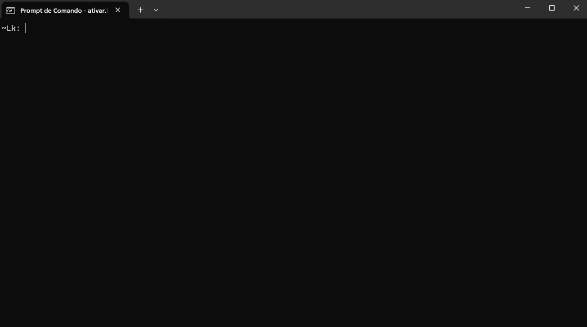

# Projeto EPM, IXC-Soft based 

## Visão Geral

Este repositório é dedicado ao desenvolvimento de ferramentas, scripts e insights para a manipulação de processos e dados do sistema ERP IXC-Soft. O foco principal é atender às necessidades específicas de provedores de acesso, facilitando a integração, análise e otimização de operações, bem como melhorar o desempenho organizacional, integrando processos relacionados ao planejamento estratégico, orçamento e análise de desempenho.

## Funcionalidades Principais

- **Integração de Dados**: Fornece scripts e utilitários para integração de dados entre o ERP IXC-Soft e outras ferramentas utilizadas pelos provedores de acesso.

- **Análise de Dados**: Interfaces para geração de gráficos e realização de scrapping de dados para fornecer uma melhor visualização, insigths e facilidade para adiquirir informações

- **Automação de Processos**: Apresenta soluções para a automação de processos específicos relacionados ao ERP IXC-Soft, visando reduzir a carga de trabalho manual.

## Requisitos do Sistema

Certifique-se de ter os seguintes requisitos instalados antes de utilizar as ferramentas deste repositório:

- Python 3.x
- Bibliotecas Python necessárias (listadas no arquivo `requirements.txt`) utilize ```pip install -r requirements.txt```

## Instalação

1. Clone este repositório:

   ```
   git clone https://github.com/seu-usuario/repo-ixc-soft.git
   ```

2. Instale as dependências:
    
    ```
    pip install -r requirements.txt
    ```
3. execute o arquivo ```manage.py```

    ```
    python manage.py
    ```

## Utilização:

Ao executar o arquivo, irá se deparar com a seguinte tela de comando:



## Comandos do Sistema

## `clear`

- **Descrição:** Limpa a tela.
  
- **Detalhes:**
  - **Funcionamento:** O comando `clear` é responsável pela limpeza de informações do sistema.
  - **Flags:**
    - `-h`: Limpa o histórico de comandos.

#### `display`

- **Descrição:** Mostra informações de sistema e visualização de data.
  
- **Detalhes:**
  - **Funcionamento:** O comando `display` é utilizado para visualização de dados. Para visualizar amostras, basta digitar: `display [flag]`. Exemplo: `display sample` exibe os dados da amostra `sample`.
  - **Parâmetros:**
    - `Boards`: Exibe todas as amostras disponíveis.
  - **Amostras:**
    - `sample`: Dados teste e fictícios para validação de novas funções.

#### `now`

- **Descrição:** Mostra o dia e a hora atual.

#### `help`

- **Descrição:** Mostra o guia de comandos. Use `help -a` para visualização detalhada. Exemplo: `help -a`, pressione Enter, depois `: display`.

#### `build`

- **Descrição:** Monta as instâncias para processos de análise, de acordo com a interface escolhida. Exemplo: `build [interface]`.
  
- **Detalhes:**
  - **Funcionamento:** O comando `build` é utilizado para que o processo/origem da análise ou processo desejado seja instanciado, trazendo as propriedades e funções de cada interface.
  - **Parâmetros:**
    - `-f`: Acessa a interface de Feedback, que executará análises e geração de gráficos baseados nos dados de feedbcak, especifícados em "amostra".
      
      **Parâmetros:**
      - `notas`: Gera um gráfico do estilo pie com a relação percentual de notas sobre os feedbacks
      - `asst`: Gera um grafico histórico que mostra a quantidade por assunto